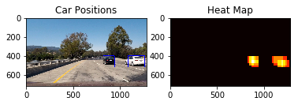
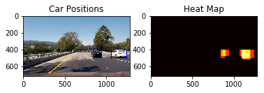

# Project Vehicle Detection

The goals / steps of this project are the following:

* Perform a Histogram of Oriented Gradients (HOG) feature extraction on a labeled training set of images and train a classifier Linear SVM classifier
* Optionally, you can also apply a color transform and append binned color features, as well as histograms of color, to your HOG feature vector. 
* Note: for those first two steps don't forget to normalize your features and randomize a selection for training and testing.
* Implement a sliding-window technique and use your trained classifier to search for vehicles in images.
* Run your pipeline on a video stream (start with the test_video.mp4 and later implement on full project_video.mp4) and create a heat map of recurring detections frame by frame to reject outliers and follow detected vehicles.
* Estimate a bounding box for vehicles detected.

This is my writeup of project Vehicle Detection.

##Histogram of Oriented Gradients (HOG)

###1. How I extracted the HOG
I used the dataset suggested in the tpis for the project, a combination images from the GTI Vehicle database and the KITTI vision benchmark suite.

The first code cell, cell #2, is just a loading and display of the test images.

Then I load the training data setin cell #3, showing that the data set contains 8792 images containing cars and 8968 images that do not contain cars.

I then in cell #4 define functions to extract the features from the images, including a binned spatial image, a color histogram and the hog features. I add a conveniance function that I also can use when searching for cars afterwards. I add these feature into a long feature vector. To be able to reuse my configuration I create a configuration dictionary in cell #5. I ended up using 2 cells per block, 8 pixels pr block all channels and LUV colorspace. Cell #6 do the actual processing to extract the features from the images.
The image below shows the hog visualisation from a car image, code in cell #7:

###2. Explain how you settled on your final choice of HOG parameters.

I tried various combinations of parameters and cannot say I found and ideal set of parameters. I did not do a colour analysis as suggested in lecture #12, but rather examined the result of the search on the test images. See image below: 

The resulting configuration tend to find some false positives.

###3. Describe how (and identify where in your code) you trained a classifier using your selected HOG features (and color features if you used them).
I then normalize my feature vectors using sklearns Standardscaler in cell #8. The image below shows the difference in the feature vector before and after the normalisation. It is easy to see that the three features that where concatinated where of very different magnitude:

The validation sample that I isolated out in cell #9 was very small, as it was only used for a random sample in cell #12. The success on the validation was very high, but since the sample was so small, the accuracy was probably incorrect.

I trained the classifier using a support vector classifier from sklearn.

The code in cell #12 and #13 is there only for me not having to rerun the whole notebook in order to test the siding window, finding cars in the images and video.

##Sliding Window Search

###1. Describe how (and identify where in your code) you implemented a sliding window search.  How did you decide what scales to search and how much to overlap windows?

The functions for drawing boxes and create the windows in cell #13 for use when searching was copied from the lecture quizzes. 

To identify where to look for cars I experimented with rectangles on top of the test images. See image below for how my rectangle fit the test images:

I then experimented with various sizes for the sliding windows in cell #17 - #21, ended up with a combination of various sizes as shown in the image below:

###2. Show some examples of test images to demonstrate how your pipeline is working.  What did you do to optimize the performance of your classifier?

To enhance the speed I tried to keep the window rectancle small, so that the number of sliding windows was minimized. I also picked up from the forums that I could use the decision_function method for the SVC on a set of features and windows rather on each window, this is shown in cell #21.

## Video Implementation

###1. Provide a link to your final video output.

The pipeline should perform reasonably well on the entire project video. 
Here's a [link to my video result](output_images/project_video_projected.mp4).

As you can see I tend to find some false positives.

###2. Describe how (and identify where in your code) you implemented some kind of filter for false positives and some method for combining overlapping bounding boxes.

I recorded the positions of positive detections in each frame of the video.  From the positive detections I created a heatmap and then thresholded that map to identify vehicle positions.  I then used `scipy.ndimage.measurements.label()` to identify individual blobs in the heatmap.  I then assumed each blob corresponded to a vehicle.  I constructed bounding boxes to cover the area of each blob detected.  

In order to keep decrease the chances for false positives I kept the heatmap from one frame to another, decreasing the effect gradually, see cell #25. This also decreses the "woblyness" from the bounding boxes around the cars.  

### Here are six test images with boxes and their corresponding heatmaps:

---

##Discussion

###1. Briefly discuss any problems / issues you faced in your implementation of this project.  Where will your pipeline likely fail?  What could you do to make it more robust?

My pipeline has a tendency to find false positives. I could have kept the positions of the labels, and only draw the bounding box on "second try", cars dont just appear. I addition to the "heatmap memory" I set up to avoid false positives.

The test video did not show any left turns, nor any cars straight ahead. I look for cars slightly to the right, so left turns migth have worsened the performance. 

I am also uncertain about the distance one should detect a car, the perpomance looks ok with me, but when the cars move ahead, i loose track of them. I could probably tune the window size to detect the cars further ahead.

The speed could probably be better, I did not understand how to implement the hog function for the whole image as suggested in lecture #38.

While I wait for Term 2, I will try to implement the pipeline with deep learning, see how that goes :).